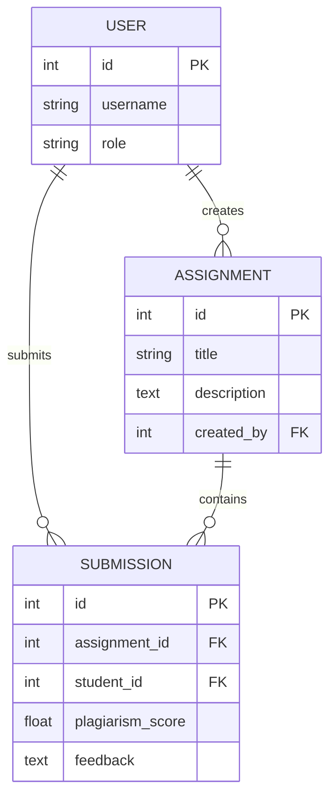

# Database Schema Explanation (ER Diagram)

The system uses a relational database structure (SQLite for development, compatible with PostgreSQL for production).

## Entities and Relationships

### 1. User (api_user)
- `id` (PK)
- `username` (Unique)
- `email`
- `password`
- `role` (Student or Instructor)

### 2. Assignment (api_assignment)
- `id` (PK)
- `title` (String)
- `description` (Text)
- `created_by` (FK -> User.id)
- `created_at` (DateTime)

### 3. Submission (api_submission)
- `id` (PK)
- `assignment_id` (FK -> Assignment.id)
- `student_id` (FK -> User.id)
- `text_content` (Text)
- `file_upload` (File Path)
- `plagiarism_score` (Float)
- `feedback` (Text)
- `grade` (Integer)
- `is_evaluated` (Boolean)

## ER Relationship Logic
- **User (Instructor) 1 : N Assignment**: One instructor can create multiple assignments.
- **Assignment 1 : N Submission**: One assignment can have many student submissions.
- **User (Student) 1 : N Submission**: One student can submit multiple assignments.

